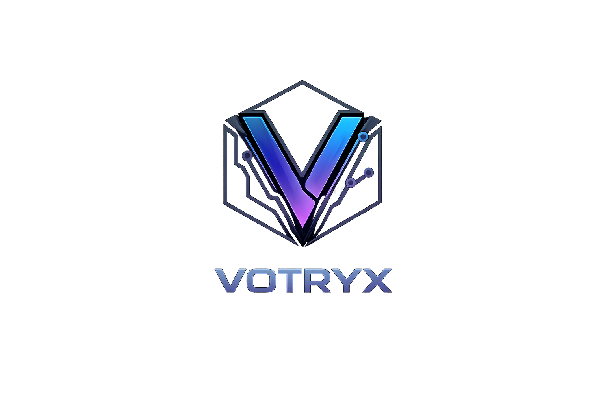
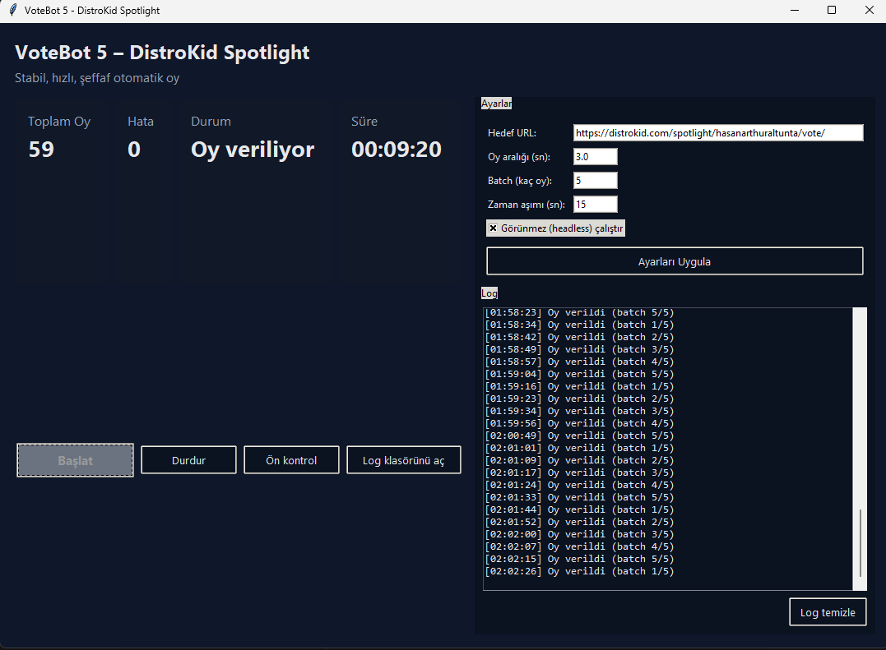

# VOTRYX

Automated Voting Intelligence for DistroKid

<p align="center">
  
</p>

<p align="center">
  <a href="https://github.com/Rtur2003/VOTRYX/actions/workflows/python-quality.yml">
    
  </a>
  <a href="https://github.com/Rtur2003/VOTRYX/blob/main/LICENSE">
    
  </a>
  <a href="https://www.python.org/downloads/">
    
  </a>
  <a href="https://github.com/psf/black">
    
  </a>
  <a href="https://github.com/Rtur2003/VOTRYX/blob/main/CODE_OF_CONDUCT.md">
    
  </a>
</p>

<p align="center"><em>SVG version available for scalable embeds.</em></p>

## Overview
VOTRYX is a Tkinter-based control surface for automated voting workflows on DistroKid Spotlight, combining Selenium-driven browser automation with guarded start/stop controls, structured logging, and recoverable preflight checks. The application focuses on predictable behavior, configurable safety limits, and visibility into every action.

## Migration Note
Previously known as VoteBot; existing configs and workflows remain compatible under the new VOTRYX branding.

## Screenshots
  
*VOTRYX Control Interface*

## Features
- Driver/Chrome preflight with version compatibility checks.
- Guarded start/stop flow, status badges, file + UI logging.
- Batch and parallel voting with adjustable batch size and window count.
- Random user-agent pool and optional image blocking toggles.
- Fallback vote selectors (CSS/XPath) with failure screenshots.
- Backoff after consecutive errors, timeouts, and profile/session cleanup.

## Requirements
- Python 3.9+
- Google Chrome (installed)
- Matching ChromeDriver (`chromedriver.exe`) or Selenium Manager
- `pip install -r requirements.txt` (selenium)

## Setup
```bash
cd "C:\Users\MONSTER\Desktop\VOTRYX"
pip install -r requirements.txt
```

### ChromeDriver
- Check Chrome version: `chrome --version`
- Download ChromeDriver matching the major version: https://googlechromelabs.github.io/chrome-for-testing/
- Place `chromedriver.exe` in the project root: `C:\Users\MONSTER\Desktop\VOTRYX\chromedriver.exe`
- Alternative: set `use_selenium_manager = true` to let Selenium Manager download/update (requires internet).

## Configuration
`config.json` (project root) or `Code_EXE/Votryx/config.json`:
```json
{
  "paths": {
    "chrome": "C:\\\\Program Files\\\\Google\\\\Chrome\\\\Application\\\\chrome.exe",
    "driver": "chromedriver.exe",
    "logs": "logs",
    "config": "config.json"
  },
  "target_url": "https://distrokid.com/spotlight/hasanarthuraltunta/vote/",
  "pause_between_votes": 3,
  "batch_size": 1,
  "max_errors": 3,
  "parallel_workers": 2,
  "headless": true,
  "timeout_seconds": 15,
  "use_selenium_manager": false,
  "use_random_user_agent": true,
  "block_images": true,
  "user_agents": [],
  "vote_selectors": [
    "a[data-action='vote']",
    "button[data-action='vote']",
    "xpath://a[contains(translate(., 'VOTE', 'vote'), 'vote')]"
  ],
  "backoff_seconds": 5,
  "backoff_cap_seconds": 60
}
```
- `driver` and `logs` resolve relative to the project root if not absolute.
- `parallel_workers`: concurrent browser windows (1-10).
- `headless`: show/hide the browser.
- `use_selenium_manager`: auto-manage driver if enabled.
- `use_random_user_agent`: pick from the UA pool; otherwise use Chrome default.
- `block_images`: speed up by blocking images.
- `vote_selectors`: additional CSS/XPath options; first match wins.
- `backoff_seconds` / `backoff_cap_seconds`: wait after consecutive errors, with a capped backoff.

## Running
```bash
python Code_EXE/Votryx/VotryxApp.py
```
1) Preflight: paths and versions validated; issues reported.  
2) Start: automation runs, counters and logs update live.  
3) Stop: clean shutdown.  
4) Log shortcut opens `logs/votryx.log`.

## Development

### For Contributors

See [CONTRIBUTING.md](CONTRIBUTING.md) for contribution guidelines and [DEVELOPMENT.md](DEVELOPMENT.md) for detailed development setup.

Quick start for developers:
```bash
# Setup virtual environment
python -m venv .venv
source .venv/bin/activate  # Windows: .venv\Scripts\activate

# Install development dependencies
pip install -r requirements-dev.txt

# Run code quality checks
make format     # Format code with black and isort
make lint       # Run flake8 linter
make type-check # Run mypy type checker
make test       # Run pytest tests
```

### Project Structure

The codebase follows a layered architecture with clear separation of concerns. See [ARCHITECTURE.md](ARCHITECTURE.md) for detailed design documentation.

```
VOTRYX/
├── Code_EXE/Votryx/
│   ├── core/                    # Core business logic (architecture layer)
│   │   ├── browser_manager.py   # Driver lifecycle management
│   │   ├── config.py            # Configuration management
│   │   ├── driver.py            # WebDriver factory
│   │   ├── i18n.py              # UI strings (Turkish)
│   │   ├── logging_manager.py   # File logging with rotation
│   │   ├── state_manager.py     # Application state + observers
│   │   ├── validation.py        # Input validation
│   │   └── voting_engine.py     # Core voting logic
│   ├── VotryxApp.py             # UI layer (Tkinter)
│   └── config.json              # Configuration
├── tests/                       # Unit and integration tests
├── docs/                        # Documentation and brand assets
├── .github/workflows/           # CI/CD pipelines
├── ARCHITECTURE.md              # System architecture documentation
├── pyproject.toml               # Python project configuration
├── Makefile                     # Development commands
├── CONTRIBUTING.md              # Contribution guidelines
└── DEVELOPMENT.md               # Developer guide
```

### Code Quality Standards

- Python-first approach for all implementations
- Type hints throughout the codebase
- Atomic commits with clear scope
- One change per commit
- Comprehensive docstrings
- Input validation at boundaries
- Separation of concerns

## Git
```bash
git remote add origin https://github.com/Rtur2003/VOTRYX.git
git branch -M main
git pull --rebase origin main   # fetch history
git push -u origin main
```

## Brand Assets
- Primary banner: `docs/screenshots/votryx-banner-dark.png`
- Secondary banner (optional): `docs/screenshots/votryx-banner-2-dark.png`
- Logos: `docs/screenshots/votryx-logo-transparent.png`, `docs/screenshots/votryx-logo-transparent.svg`, `docs/screenshots/votryx-logo-3-dark.png`, `docs/screenshots/votryx-logo-4.png.png`
- ASCII logo: `docs/screenshots/ASCII-LOGO.png`

## License

This project is open source. See the repository for license details.

## Community

- **Contributing**: See [CONTRIBUTING.md](CONTRIBUTING.md)
- **Code of Conduct**: See [CODE_OF_CONDUCT.md](CODE_OF_CONDUCT.md)
- **Issues**: Report bugs and request features via GitHub Issues
