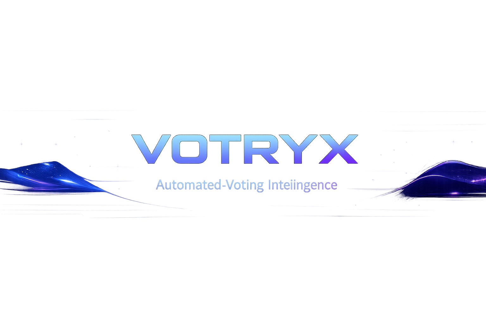
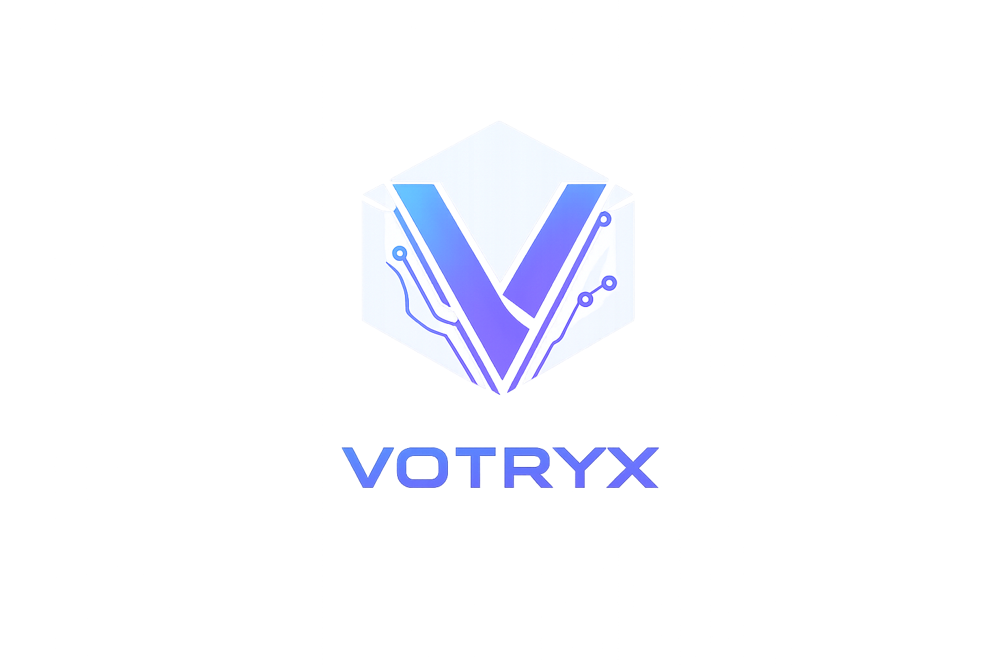
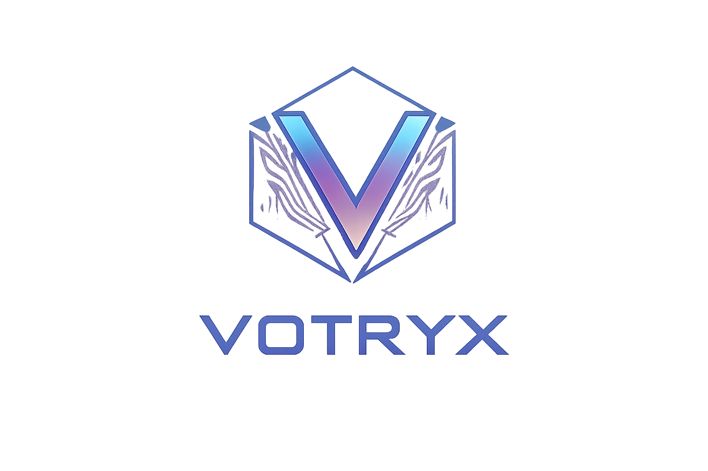
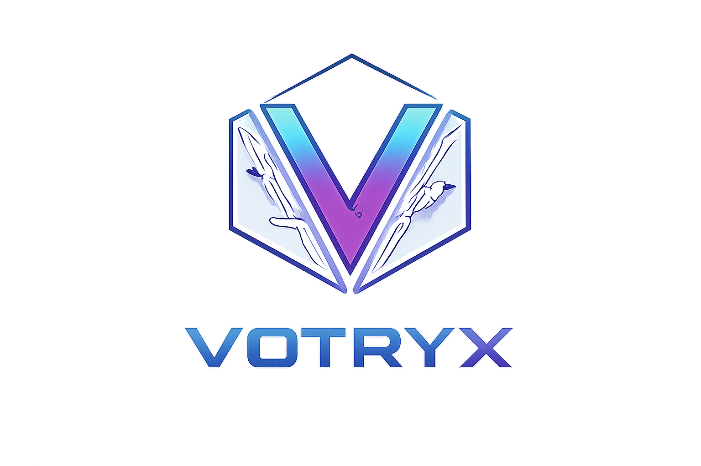
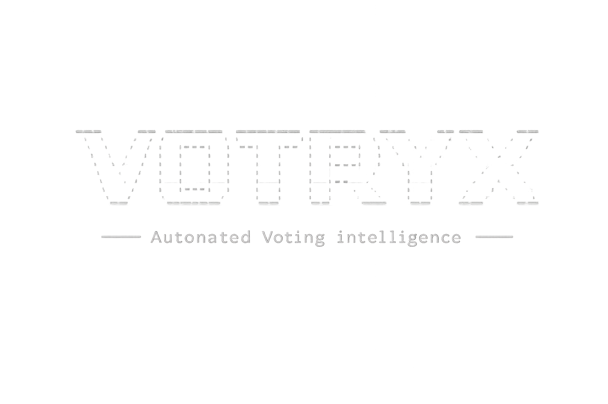

# VOTRYX Visual Gallery

This page exists to ensure every visual asset in `docs/screenshots/` has a clear purpose and is referenced.

## Banners

## Logos (PNG)

## Logos (SVG)

`votryx-logo-transparent.svg` is included for scalable embeds.

## UI

## Extras

